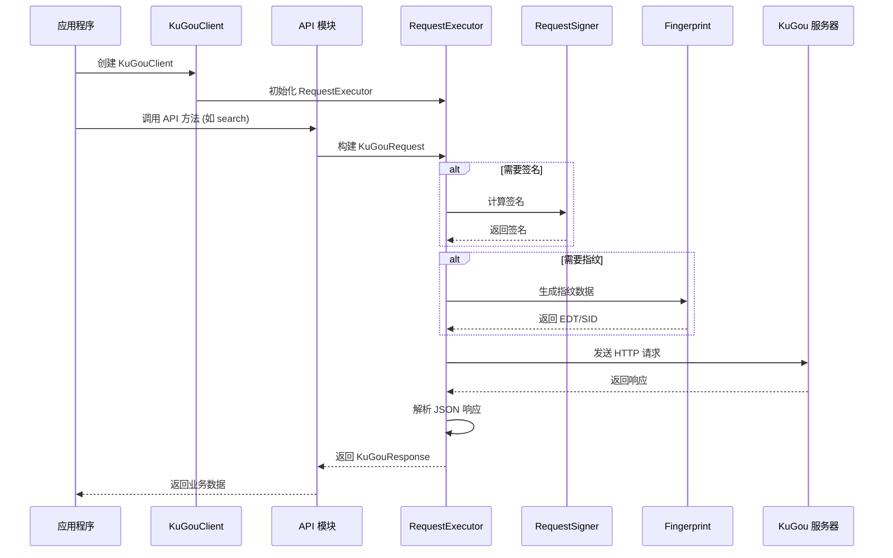
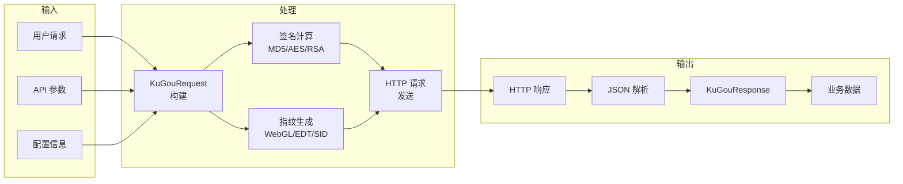

# AGENTS.md

## 项目概述

Kotlin Multiplatform SDK for KuGou Music API。对齐 [MakcRe/KuGouMusicApi](https://github.com/MakcRe/KuGouMusicApi) Node.js 实现。支持 Android、iOS、JVM、Web (Wasm/JS)。

## 构建命令

```bash
# 构建所有平台
./gradlew :shared:build

# 快速 JVM 验证
./gradlew :shared:compileKotlinJvm

# 运行桌面应用
./gradlew :desktopApp:run

# 运行 Web 应用 (Wasm)
./gradlew :webApp:wasmJsBrowserDevelopmentRun

# Android 调试构建
./gradlew :androidApp:assembleDebug
```

## 测试

```bash
# 运行所有测试
./gradlew :shared:allTests

# 仅运行 JVM 测试（最快）
./gradlew :shared:jvmTest

# 运行特定测试类
./gradlew :shared:jvmTest --tests "top.ghhccghk.multiplatform.kugouapi.core.FingerprintTest"
```

测试位于 `shared/src/commonTest/`。使用 `kotlin.test` 和 `kotlinx.coroutines.test`。

## 发布到 Maven Central

需要 `local.properties` 包含：
- `mavenCentralUsername`
- `mavenCentralPassword`
- `signing.keyId`、`signing.password`、`signing.secretKeyRingFile`

```bash
# 本地发布
./gradlew :shared:publishToMavenLocal

# 发布到 Central
./gradlew :shared:publishAndReleaseToMavenCentral
```

使用 `com.vanniktech.maven.publish` 插件。POM 元数据在 `gradle.properties` 中。

## 项目结构

```
shared/                    # SDK 库 (KMP)
  src/commonMain/          # 共享代码
    api/                   # 21 个 API 模块
    core/                  # 请求执行器、加密、指纹、Cookie 管理
    model/                 # 枚举和数据模型
  src/androidMain/         # Android 特定代码 (OkHttp 引擎)
  src/iosMain/             # iOS 特定代码 (Darwin 引擎)
  src/jvmMain/             # JVM 特定代码 (CIO 引擎)
  src/jsMain/              # JS 特定代码
  src/wasmJsMain/          # Wasm 特定代码
  src/webMain/             # 共享 Web 代码 (JS + Wasm)
  src/commonTest/          # 共享测试
androidApp/                # Android 示例应用
desktopApp/                # 桌面 (JVM) 示例应用
webApp/                    # Web 示例应用 (JS + Wasm)
iosApp/                    # iOS 示例应用 (Xcode)
```

## API 模块详解

### 1. 认证与用户管理
- **AuthApi** (`AuthApi.kt`) - 设备注册、登录、验证码、Token 管理
- **UserApi** (`UserApi.kt`) - 用户信息、收藏、历史记录、关注管理

### 2. 内容搜索与发现
- **SearchApi** (`SearchApi.kt`) - 综合搜索、歌词搜索、专辑搜索、歌手搜索、MV 搜索
- **RecommendApi** (`RecommendApi.kt`) - 个性化推荐、每日推荐、新歌推荐
- **RankApi** (`RankApi.kt`) - 排行榜、热歌榜、新歌榜
- **TopApi** (`TopApi.kt`) - 精选歌单、热门话题

### 3. 音乐内容
- **SongApi** (`SongApi.kt`) - 歌曲详情、歌词、播放链接、音质选择
- **AlbumApi** (`AlbumApi.kt`) - 专辑详情、专辑歌曲列表
- **ArtistApi** (`ArtistApi.kt`) - 歌手详情、歌手歌曲、歌手专辑
- **PlaylistApi** (`PlaylistApi.kt`) - 歌单详情、歌单歌曲、歌单分类

### 4. 多媒体内容
- **VideoApi** (`VideoApi.kt`) - MV 播放、视频详情、视频搜索
- **ImageApi** (`ImageApi.kt`) - 封面图片、歌手图片、专辑图片
- **LongAudioApi** (`LongAudioApi.kt`) - 有声书、播客、长音频内容

### 5. 社交与互动
- **CommentApi** (`CommentApi.kt`) - 评论列表、热门评论、评论点赞
- **SheetApi** (`SheetApi.kt`) - 歌单创建、编辑、分享
- **BlacklistApi** (BlacklistApi.kt) - 黑名单管理、歌曲/歌手屏蔽
- **UserCloudApi** (UserCloudApi.kt) - 用户云盘、文件上传、匹配

### 6. 场景与特色
- **SceneMusicApi** (`SceneMusicApi.kt`) - 场景音乐（运动、学习、睡眠等）
- **RadioApi** (`RadioApi.kt`) - 电台、电台节目
- **AudioMatchApi** (`AudioMatchApi.kt`) - 听歌识曲、音频匹配
- **YouthApi** (`YouthApi.kt`) - 青少年模式、适龄内容
- **YuekuApi** (`YuekuApi.kt`) - 乐库、音乐分类浏览
- **ListenTogetherApi** (ListenTogetherApi.kt) - 一起听、音乐房间、聊天、点歌
- **EffectsApi** (EffectsApi.kt) - 音效管理、耳机音效、社区音效

### 7. 系统与杂项
- **MiscApi** (`MiscApi.kt`) - 系统配置、版本检查、客户端设置

## 核心功能架构

### 1. 入口点 - KuGouClient
```kotlin
class KuGouClient(
    val config: KuGouConfig = KuGouConfig(),
    val cookieJar: CookieJar = CookieJar(config)
) {
    private val executor = RequestExecutor(config, cookieJar)
    
    // 所有 API 模块实例
    val auth = AuthApi(executor)
    val search = SearchApi(executor)
    val album = AlbumApi(executor)
    // ... 其他 18 个 API 模块
}
```

### 2. 请求执行器 - RequestExecutor
- **单例 HttpClient**: Ktor 客户端，所有实例共享
- **线程安全**: 所有请求状态为栈本地
- **JSON 序列化**: kotlinx.serialization 配置
- **资源管理**: 应用退出时调用 `shutdown()`

### 3. 请求签名 - RequestSigner
- **MD5 签名**: 用于普通 API 请求
- **AES-CBC 加密**: 敏感数据加密
- **RSA-PKCS1 签名**: 高安全性请求
- **平台特定**: Android 和 Web 使用不同盐值

### 4. 指纹生成 - Fingerprint
- **WebGL 哈希**: 浏览器指纹生成
- **EDT 数据**: 设备行为事件数据
- **SID 生成**: 会话标识符
- **SSA 验证**: 安全签名验证

### 5. Cookie 管理 - CookieJar
- **dfid 管理**: 设备标识符，大多数 API 需要
- **会话维护**: 跨请求保持登录状态
- **多实例隔离**: 每个 KuGouClient 实例独立

### 6. 配置系统 - KuGouConfig
```kotlin
data class KuGouConfig(
    val appId: Int = 1005,
    val clientVersion: Int = 20489,
    val liteAppId: Int = 3116,
    val liteClientVersion: Int = 11436,
    val isLite: Boolean = true,
    val defaultBaseUrl: String = "https://gateway.kugou.com",
    val timeoutMs: Long = 30_000,
    val userAgent: String = "Android15-1070-11083-46-0-DiscoveryDRADProtocol-wifi",
)
```

### 7. 请求/响应模型
- **KuGouRequest**: URL、方法、参数、头部、签名类型
- **KuGouResponse**: HTTP 状态码、响应体、错误信息
- **JsonObject**: 响应体格式，通过 `response.body["key"]` 访问

## 关键约定

- 所有 API 方法都是 `suspend` 函数
- 响应体是 `JsonObject` — 通过 `response.body["key"]` 访问
- 业务状态：`status == 0` 或 `error_code != 0` 映射到 HTTP 502
- Cookies：大多数 API 需要 `dfid` — 先调用 `auth.registerDev()`
- `isLite` 配置标志在 Lite 和完整 API 签名/盐值之间切换
- 注释和代码使用中文 — 保持此约定

## 依赖项

- **HTTP**: Ktor 3.5.0 (Android 用 OkHttp，iOS 用 Darwin，JVM 用 CIO，Web 用 JS)
- **序列化**: kotlinx.serialization
- **字节/IO**: Okio 3.17.0
- **UI**: Compose Multiplatform 1.11.0
- **Kotlin**: 2.3.21

## 平台说明

- **Web (JS/Wasm)**: CORS 限制 — 需要服务器代理或浏览器扩展
- **iOS**: 为非 HTTPS 请求配置 ATS
- **JVM**: 需要 Java 11+
- **Android**: minSdk 24，compileSdk 37

## Gradle 配置

- 配置缓存启用
- 构建缓存启用
- JVM 参数：`-Xmx4096M` (Gradle)，`-Xmx3072M` (Kotlin 守护进程)
- 版本目录：`gradle/libs.versions.toml`

## 测试策略

### 当前测试
- **FingerprintTest**: 测试指纹生成功能
  - WebGL 哈希生成
  - EDT 数据生成
  - SID 生成

### 测试框架
- **kotlin.test**: 跨平台测试框架
- **kotlinx.coroutines.test**: 协程测试支持
- **测试位置**: `shared/src/commonTest/kotlin/`

### 测试命令
```bash
# 运行所有平台测试
./gradlew :shared:allTests

# 仅运行 JVM 测试（开发期间最快）
./gradlew :shared:jvmTest

# 运行特定测试
./gradlew :shared:jvmTest --tests "top.ghhccghk.multiplatform.kugouapi.core.FingerprintTest"
```

## 开发工作流

### 1. 本地开发
```bash
# 启动桌面应用进行测试
./gradlew :desktopApp:run

# 启动 Web 应用
./gradlew :webApp:wasmJsBrowserDevelopmentRun
```

### 2. 代码检查
```bash
# 编译检查
./gradlew :shared:compileKotlinJvm

# 运行测试
./gradlew :shared:jvmTest
```

### 3. 发布流程
```bash
# 本地发布到 Maven Local
./gradlew :shared:publishToMavenLocal

# 发布到 Maven Central
./gradlew :shared:publishAndReleaseToMavenCentral
```

## 故障排除

### 常见问题
1. **dfid 缺失**: 大多数 API 需要设备标识符，先调用 `auth.registerDev()`
2. **签名错误**: 检查 `isLite` 配置是否与 API 端点匹配
3. **CORS 错误**: Web 平台需要代理或浏览器扩展
4. **超时**: 调整 `KuGouConfig.timeoutMs` 值

### 调试技巧
- 启用 Ktor 日志：在 `RequestExecutor` 中配置
- 检查网络请求：使用平台网络调试工具
- 验证签名：对比 Node.js 实现的签名逻辑

## 贡献指南

### 代码风格
- 遵循 Kotlin 官方编码规范
- 保持中文注释和文档
- 使用 `suspend` 函数处理异步操作

### 提交规范
- 提交信息使用中文
- 描述清楚修改内容和原因
- 关联相关 issue（如有）

### 测试要求
- 新功能必须包含测试
- 修改现有功能需要更新测试
- 确保所有平台测试通过

## 项目架构图

```mermaid
graph TD
    subgraph "应用层"
        A[Android App] --> SDK
        D[Desktop App] --> SDK
        W[Web App] --> SDK
        I[iOS App] --> SDK
    end
    
    subgraph "SDK 核心 (shared)"
        SDK[KuGouClient] --> EX[RequestExecutor]
        SDK --> CJ[CookieJar]
        SDK --> CFG[KuGouConfig]
        
        EX --> HC[HttpClient<br>Ktor]
        EX --> RS[RequestSigner]
        EX --> FP[Fingerprint]
        
        subgraph "API 模块 (21个)"
            API1[AuthApi]
            API2[SearchApi]
            API3[SongApi]
            API4[AlbumApi]
            API5[ArtistApi]
            API6[PlaylistApi]
            API7[CommentApi]
            API8[VideoApi]
            API9[ImageApi]
            API10[LongAudioApi]
            API11[RankApi]
            API12[SceneMusicApi]
            API13[MiscApi]
            API14[UserApi]
            API15[RadioApi]
            API16[RecommendApi]
            API17[SheetApi]
            API18[AudioMatchApi]
            API19[YuekuApi]
            API20[YouthApi]
            API21[TopApi]
        end
        
        API1 --> EX
        API2 --> EX
        API3 --> EX
        API4 --> EX
        API5 --> EX
        API6 --> EX
        API7 --> EX
        API8 --> EX
        API9 --> EX
        API10 --> EX
        API11 --> EX
        API12 --> EX
        API13 --> EX
        API14 --> EX
        API15 --> EX
        API16 --> EX
        API17 --> EX
        API18 --> EX
        API19 --> EX
        API20 --> EX
        API21 --> EX
    end
    
    subgraph "平台特定实现"
        HC -->|Android| OkHttp[OkHttp 引擎]
        HC -->|iOS| Darwin[Darwin 引擎]
        HC -->|JVM| CIO[CIO 引擎]
        HC -->|Web| JS[JS 引擎]
    end
    
    subgraph "外部服务"
        EX --> KS[KuGou API 服务器]
    end
    
    style SDK fill:#e1f5fe
    style EX fill:#f3e5f5
    style CJ fill:#e8f5e8
    style CFG fill:#fff3e0
    style HC fill:#fce4ec
    style RS fill:#f1f8e9
    style FP fill:#e0f7fa
```



## 请求流程图



## 数据流图



## 模块依赖图

```mermaid
graph TB
    subgraph "核心层"
        CFG[KuGouConfig]
        CJ[CookieJar]
        HC[HttpClient]
        RS[RequestSigner]
        FP[Fingerprint]
        EX[RequestExecutor]
    end
    
    subgraph "API 层"
        Auth[AuthApi]
        Search[SearchApi]
        Song[SongApi]
        Album[AlbumApi]
        Artist[ArtistApi]
        Playlist[PlaylistApi]
        Comment[CommentApi]
        Video[VideoApi]
        Image[ImageApi]
        LongAudio[LongAudioApi]
        Rank[RankApi]
        SceneMusic[SceneMusicApi]
        Misc[MiscApi]
        User[UserApi]
        Radio[RadioApi]
        Recommend[RecommendApi]
        Sheet[SheetApi]
        AudioMatch[AudioMatchApi]
        Yueku[YuekuApi]
        Youth[YouthApi]
        Top[TopApi]
    end
    
    subgraph "应用层"
        Client[KuGouClient]
    end
    
    CFG --> EX
    CJ --> EX
    HC --> EX
    RS --> EX
    FP --> EX
    
    Auth --> EX
    Search --> EX
    Song --> EX
    Album --> EX
    Artist --> EX
    Playlist --> EX
    Comment --> EX
    Video --> EX
    Image --> EX
    LongAudio --> EX
    Rank --> EX
    SceneMusic --> EX
    Misc --> EX
    User --> EX
    Radio --> EX
    Recommend --> EX
    Sheet --> EX
    AudioMatch --> EX
    Yueku --> EX
    Youth --> EX
    Top --> EX
    
    Client --> Auth
    Client --> Search
    Client --> Song
    Client --> Album
    Client --> Artist
    Client --> Playlist
    Client --> Comment
    Client --> Video
    Client --> Image
    Client --> LongAudio
    Client --> Rank
    Client --> SceneMusic
    Client --> Misc
    Client --> User
    Client --> Radio
    Client --> Recommend
    Client --> Sheet
    Client --> AudioMatch
    Client --> Yueku
    Client --> Youth
    Client --> Top
```


